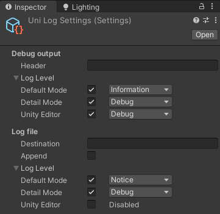
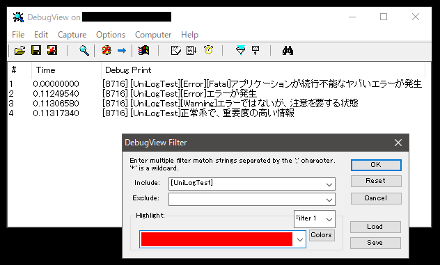

# UniLog

## 概要

- UnityEngine.Debug.Log のような手軽さでログ出力を書くための Unity 向けアセット
- Unity エディタのコンソールウィンドウだけでなく、ログファイルやデバッグ出力<sup>[1](#note_DebugOutput)</sup> にも出力できる
- 出力ごとにログレベル（Error、Warning、Notice など）を指定できる
- 実行時の状況（エディタで再生、アプリ実行 など）ごとに、出力するログレベルの閾値を設定できる

## 使い方（最低限）

### インストール

[UniLog の unitypackage をダウンロード](https://github.com/kitsune-soba/UniLog/releases)してインポートする。

### スクリプトにログ出力を書く

以下のようにログ出力のコードを書く。この例ではログレベルが Error のログが出力される。  
ログレベルは強い順に `Fatal`, `Error`, `Warning`, `Notice`, `Information`, `Debug` が定義されている。

```
using UniLog;

...

Log.WriteLine("This is an error message.", LogLevel.Error);
```

## 使い方（詳細）

### 設定

Assets/UniLog/Resources/UniLogSettings を選択すると、インスペクタに以下のような設定が表示されるので、適宜設定する。



- Debug output<sup>[1](#note_DebugOutput) </sup>
	- Filtering Keyword: 全てのデバッガ向け出力の先頭に自動的に挿入される文字列。[DebugView](https://docs.microsoft.com/en-us/sysinternals/downloads/debugview) などでデバッグ出力を見る際のフィルタリングに用いる。通常はアプリケーション名を指定する。
	- Log Level: 動作モード（後述）ごとの出力の閾値。チェックマークを外すと、そのモードではデバッグ出力されない。
- Log file
	- Destination: ログファイルの出力先。
	- Append: ログファイルを追記モードで開く。（無効の場合は上書きモードで開く。）
	- Log Level: 動作モード（後述）ごとの出力の閾値。チェックマークを外すと、そのモードではログファイルに出力されない。

また、UniLog の動作モード（後述）を Detail Mode にする場合は、全てのログ出力に先立って以下のように `detailMode` を true にする。

```
Log.settings.detailMode = true;
```

### 動作モード

UniLog には3つの動作モードがある。

- Default Mode: デプロイされたアプリとして実行中であればこのモードで動作する。
- Detail Mode: デプロイされたアプリとして実行中に `detailMode` フラグが立つとこのモードになる。普段はエラーや警告のログだけを出力したいが、不具合対応の時だけ詳細なログを有効化したい場合に使用する。使い方の例として、特定のコマンドライン引数や設定項目で `detailMode` フラグが立つようにスクリプトを書いておけば、不具合に遭遇したユーザにその引数や設定項目を教えることで、問題解決のための詳細ログの提供を要請できる。ログ出力はそれなりの処理コストが掛かるため、Default Mode ではあまり多量のログを出力せず、問題解決の必要がある場合にのみ Detail Mode で詳細なログを出力するべき。
- Unity Editor: エディタでの再生中であればこのモードで動作する。`detailMode` フラグは無視される。

## 実行例

上の画像のように設定し、このコード↓を書き、デプロイしてアプリを実行する。

```
// detailMode フラグは立てていない（Default Mode で動作する）

// デバッグ出力＆ログファイル出力される
Log.WriteLine("アプリケーションが続行不能なヤバいエラーが発生", LogLevel.Fatal);
Log.WriteLine("エラーが発生", LogLevel.Error);

// デバッグ出力される
Log.WriteLine("エラーではないが、注意を要する状態", LogLevel.Warning);
Log.WriteLine("正常系で、重要度の高い情報", LogLevel.Notice);

// 出力されない
Log.WriteLine("普通の情報", LogLevel.Information); // こうも書ける：Log.WriteLine("普通の情報");
Log.WriteLine("基本的にユーザに公開すべきでない、開発者向けの詳細情報", LogLevel.Debug);
```

以下のような実行結果が得られる。

（[DebugView](https://docs.microsoft.com/en-us/sysinternals/downloads/debugview)でデバッグ出力を確認）  


（output.log の内容）  
```
Log start at 2020/02/18 21:43:42
Application: UniLogSample 1.0.0
Platform: WindowsPlayer
--------------------------------------------------------------------------------
0.000	| [Error][Fatal]アプリケーションが続行不能なヤバいエラーが発生
0.004	| [Error]エラーが発生

```
なお、ログファイル内に記録されるアプリケーション名は、Unity プロジェクトの PlayerSettings > Player > Product Name, Version が参照される。

## 開発環境

- Unity 2019.2.16f1

## UniLog の unitypackage の作り方

このプロジェクトの Assets/UniLog 以下のアセットをエクスポートする。

## 既知の問題 / 制限

- 現状、デバッグ出力は Windows のみで動作する。他の環境でのデバッグ出力に対応したければ、UniLog/Assets/UniLog/Scripts/LogOutput.cs の `WriteDebugOutputLine` メソッドに他の環境向けのコードを追加する必要がある。

---
<sup name="note_DebugOutput">1</sup> Windows であれば DBWIN_BUFFER（[DebugView](https://docs.microsoft.com/en-us/sysinternals/downloads/debugview) とかで見れるやつ）に出力される。
