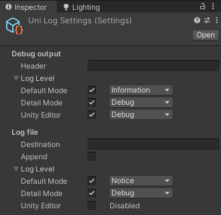
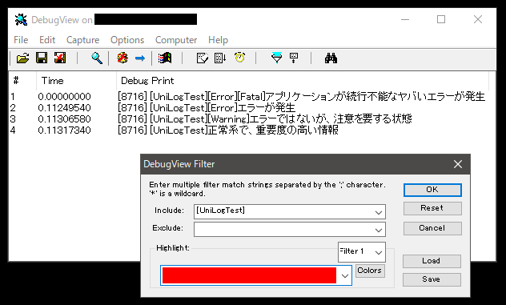

# UniLog

## 概要

スクリプトから UnityEngine.Debug.Log のような手軽さでログを出力するための Unity 向けアセット。

ログ出力ごとにログレベル（Error, Warning, Notice, etc...）を指定でき、実行時の状況（エディタ上での再生か、デプロイ版の再生か、など）ごとに、出力するログレベルの閾値を設定できる。
また、ログの出力先（デバッガ<sup>[1](#note_DebugOutput) </sup> <sup>[2](#note_DebugOutputWinOnly) </sup> and/or ログファイル）も制御できる。勿論、Unity エディタのコンソールにも出力される。

開発者によるアプリケーションのデバッグや、アプリケーションの不具合に遭遇したユーザからのフィードバックを得るための簡易な方法としてお使いください。

## 開発環境

- Unity 2019.2.16f1

## 使い方

### インストール

UniLog_*.unitypackage を Unity のプロジェクトにインポートする。

### ログ出力のスクリプトを書く

プロジェクト内のスクリプトで、以下のようにログ出力のコードを書く。
この例では、ログレベルが Error のログが出力される。
（ログレベルは、レベルが低い順に Fatal, Error, Warning, Notice, Information, Debug が定義されている。）

```
// using UniLog してあるという前提
Log.WriteLine("This is an error message.", LogLevel.Error);
```

また、UniLog を Detail Mode（後述）で動作させる場合は、全てのログ出力に先立って以下のように detailMode フラグを立てる。

```
// using UniLog してあるという前提
Log.settings.detailMode = true; // Detail Mode へ切り替え
```

#### 動作モードの説明

UniLog には3種類の動作モードがある。

- Default Mode: デプロイされたアプリとして実行中であればこのモードで動作する。
- Detail Mode: デプロイされたアプリとして実行中で、スクリプトで UniLog.Log.settings.detailMode に true を指定した場合はこのモードで動作する。これは、通常はエラーや警告のログだけを出力したいが、アプリケーションの不具合に遭遇した場合などに詳細なログを有効化するための用途として使用する。例えば、特定のコマンドライン引数が渡された場合や、設定ファイル内の特定の項目が有効化されている場合に detailMode フラグを立てるようにスクリプトを書いておけば、不具合に遭遇したユーザにその引数や設定項目を教えて、問題解決に役立つ詳細なログを得ることができる。ログ出力はそれなりの処理コストが掛かるため、Default Mode ではあまり詳細なログを出力せず、問題解決の必要がある場合のみ Detail Mode で詳細なログを出力するべき。
- Unity Editor: エディタでの再生中であればこのモードで動作する。detailMode フラグは無視される。

### ログ出力の設定

Assets/UniLog/Resources/UniLogSettings を選択すると、インスペクタに以下のような設定が表示されるので、適宜設定する。



- Debug output<sup>[1](#note_DebugOutput) </sup> <sup>[2](#note_WinOnly) </sup>
	- Filtering Keyword: 全てのデバッガ向け出力にこのキーワードが付加される。[DebugView](https://docs.microsoft.com/en-us/sysinternals/downloads/debugview) などで出力を確認する際のフィルタリングに用いる。通常はアプリケーション名を指定する。
	- Log Level: 動作モードごとに、出力の閾値となるログレベルを指定する。チェックマークを外すと、そのモードでのデバッガ向け出力は無効化される。
- Log file
	- Destination: ログファイルの出力先。
	- Append: ログファイルの追記モード。（無効の場合は上書きモードとなる。）
	- Log Level: 動作モードごとに、出力の閾値となるログレベルを指定する。チェックマークを外すと、そのモードでのログファイル出力は無効化される。

例えば、上に載せた画像の通りに設定されている場合、以下のコードを Default Mode で実行した際は、Notice 以下のレベルのメッセージがデバッガ向けに出力され、Error 以下のレベルのメッセージがログファイルに出力される。

**サンプルコード**
```
// デバッグ出力される。ログファイルにも記録される。
Log.WriteLine("アプリケーションが続行不能なヤバいエラーが発生", LogLevel.Fatal);

// デバッグ出力される。ログファイルにも記録される。
Log.WriteLine("エラーが発生", LogLevel.Error);

// デバッグ出力される。ログファイルには記録されない。
Log.WriteLine("エラーではないが、注意を要する状態", LogLevel.Warning);

// デバッグ出力される。ログファイルには記録されない。
Log.WriteLine("正常系で、重要度の高い情報", LogLevel.Notice);

// デバッグ出力されない。ログファイルにも記録されない。
Log.WriteLine("普通の情報"); // こう書いても同じ：Log.WriteLine("普通の情報", LogLevel.Information);

// デバッグ出力されない。ログファイルにも記録されない。
Log.WriteLine("基本的にユーザに公開すべきでない、開発者向けの詳細情報", LogLevel.Debug);
```

**サンプルコードの実行結果（DebugViewで確認）**


**サンプルコードの実行結果（output.log の内容）**
```
Log start at 2020/02/18 21:43:42
Application: UniLogSample 1.0
Platform: WindowsPlayer
--------------------------------------------------------------------------------
0.000	| [Error][Fatal]アプリケーションが続行不能なヤバいエラーが発生
0.004	| [Error]エラーが発生

```
なお、ログファイルに記録されるアプリケーション名は、Unity プロジェクトの PlayerSettings > Player > Product Name, Version が参照される。

## 既知の問題 / 制限

現状、デバッガ向けの出力は Windows のみに対応している。
UniLog/Assets/UniLog/Scripts/LogOutput.cs の WriteDebugOutputLine メソッドに他のプラットフォーム向けのコードを追加すれば解決するが、開発者が現状 Windows 向けの開発環境/スキルしか持っていないため未実装。

## プロジェクトから unitypackage をエクスポートする方法

Assets/UniLog 以下のアセットをエクスポートする。

---
<sup name="note_DebugOutput">1</sup> デバッガ向け出力は、エディタ再生時であればコンソールウィンドウで出力を確認できる。また、デプロイされたアプリの再生時ならば [DebugView](https://docs.microsoft.com/en-us/sysinternals/downloads/debugview) などで確認できる。  
<sup name="note_DebugOutputWinOnly">2</sup> 現状、デバッガ向け出力は Windows 向けのみ対応。
